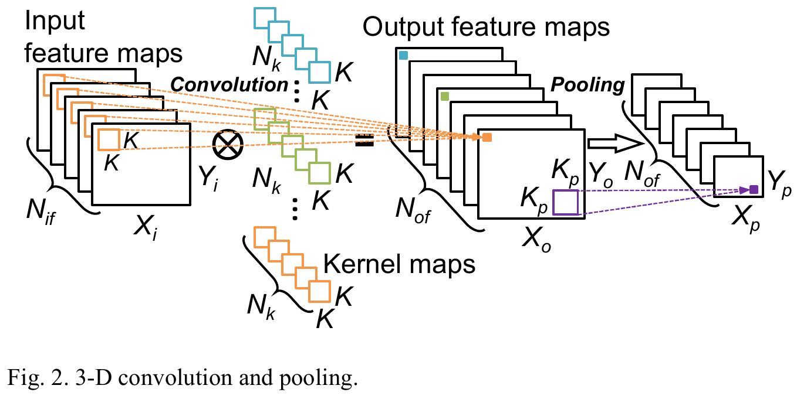

## 论文阅读记录

### Scalable and Modularized RTL Compilation of Convolutional Neural Networks onto FPGA

> 论文连接：Yufei Ma, N. Suda, Yu Cao, J. -s. Seo and S. Vrudhula, "Scalable and modularized RTL compilation of Convolutional Neural Networks onto FPGA," 2016 26th International Conference on Field Programmable Logic and Applications (FPL), Lausanne, Switzerland, 2016, pp. 1-8, doi: 10.1109/FPL.2016.7577356.

本文的主要工作：

- 一个通过分析输入 CNN 模型的结构和尺寸，以及由用户设置的计算并行度，然后生成并整合参数化的 CNN 模型的CNN RTL 编译器；
- 由该编译器生成加速系统，并通过两个大型 CNN 网络（AlexNet 和 NIN 且对每一张输入图像具有百万级计算量）在具有型号为 Stratix-V 的 FPGA 的 DE5-Net 的板子上分别实现了114.5GOPS、117.3GOPS 的吞吐量。

图1. 具有 RTL 编译器方案的编译流程

图2. CNN 网络的卷积与池化过程

卷积（Conv）操作的计算：
$$
out(f_o,x,y)=\sum_{f_i=0}^{N_{if}} \sum_{k_x=0}^K \sum_{k_y=0}^K wt(f_o,f_i,k_x,k_y) \times in(f_i,x+k_x,y+k_y) \tag{1}
$$
其中，$out(f_o,x,y)$ 和 $in(f_i,x,y)$ 分别代表了在输出特征图 $f_o$ 和输入特征图 $f_i$ 上位置 $(x,y)$ 的神经元值；$wt(f_o,f_i,k_x,k_y)$ 代表位置 $(k_x,k_y)$ 的核权重，它与输入特征图 $f_i$ 卷积得到输出特征图 $f_o$ 

池化（Pooling）操作在卷积操作之后通过核大小为 $K_p \times K_p$ 上取平均值或极大值减小输入特征图的维数。

正则化（Norm）或者局部响应正则化（LRN local response normalization）的计算：
$$
out(f_o,x,y)=\frac{in(f_o,x,y)}{\left(1+\frac{\alpha}{K}\sum_{f_i=f_o-\frac{K}{2}}^{f_o+\frac{K}{2}}in^2(f_i,x,y)\right)^\beta}
$$
全连接（FC）层是最终的分类层。

卷积层和全连接层遵循非线性激活函数，例如 tahh、sigmoid、ReLU（Rectified Linear Unit）

图3. AlexNet 与 NIN 网络的结构

## 额外知识补充

FPGA 开发五个级别：系统级、算法级、RTL级、门级、开关级

- 算法级：主要用于快速验证算法的正确性，不一定可以综合成实际电路结构
- 结构级：更接近电路的实际结构，电路的层次化描述，类似于电路框图
- RTL级：贴近实际电路结构的描述，描述的细节到寄存器内容传输级别，可以精确描述电路的工作原理、执行顺序，细化到寄存器级别的结构描述也就是RTL级描述，并无绝对划分标准
- 开关级：完整描述了电路的细节，最底层的电路描述，可以描述 pmos/nmos